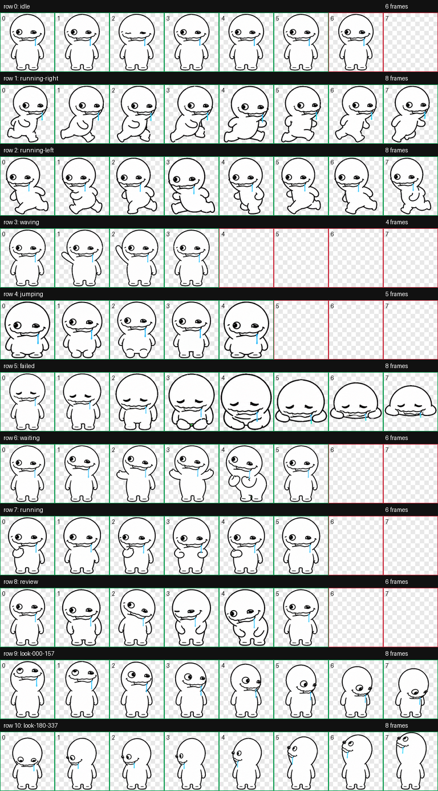
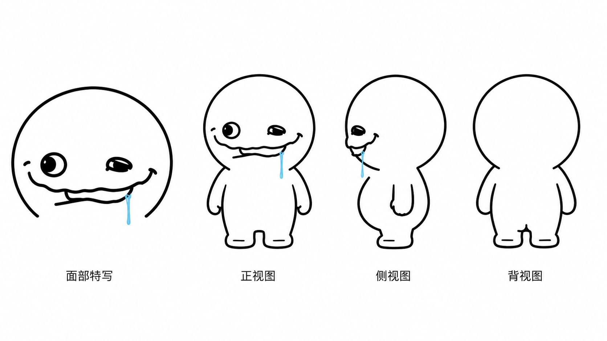

# 旱厕蜗牛 · Codex Pet


“旱厕蜗牛”是由 **korn** 设计并制作成 Codex v2 动画宠物的白色圆头角色：粗黑手绘轮廓、不对称眼睛、憨笑，以及嘴角附着的一小条蓝色口水。

这个仓库同时提供三样东西：

1. 可以直接安装的完整宠物包；
2. macOS、Linux 与 Windows 一键安装入口；
3. 一份从个人 IP 设定图到 Codex 宠物、再到 GitHub 分发的中文教程。

<p align="center">
  
  
  
  
</p>

## 一键安装

GitHub 会过滤直接唤起桌面应用的 `codex://` 链接，因此这里提供经过实际测试的系统命令。复制与你系统对应的一行即可完成安装。

也可以把下面这句话直接发给 Codex：

> 请为我安装 GitHub 仓库 `kornpng/hance-woniu-codex-pet` 中的 Codex 宠物“旱厕蜗牛”，只安装这个宠物，不要修改其他宠物。

### macOS / Linux

```bash
curl -fsSL https://raw.githubusercontent.com/kornpng/hance-woniu-codex-pet/main/scripts/install.sh | bash
```

### Windows PowerShell

```powershell
powershell -NoProfile -ExecutionPolicy Bypass -Command "irm https://raw.githubusercontent.com/kornpng/hance-woniu-codex-pet/main/scripts/install.ps1 | iex"
```

安装脚本只会更新 `hance-woniu--korn` 这个目录，不会修改其他宠物。默认安装位置：

- macOS / Linux：`~/.codex/pets/hance-woniu--korn/`
- Windows：`%USERPROFILE%\.codex\pets\hance-woniu--korn\`

安装完成后，重启 Codex，在“设置 → 宠物”中选择它；部分版本的入口显示为“设置 → 外观 → 宠物”。

## 完整动画

| 待机                      | 向右移动                           | 向左移动                          | 挥手                        |
| ------------------------- | ---------------------------------- | --------------------------------- | --------------------------- |
|  |  |  |  |

| 跳跃                         | 失败                        | 等待                         | 工作中                       | 审阅                        |
| ---------------------------- | --------------------------- | ---------------------------- | ---------------------------- | --------------------------- |
|  |  |  |  |  |

| 000° → 157.5°                     | 180° → 337.5°                     |
| --------------------------------- | --------------------------------- |
|  |  |

<details>
<summary>查看 8×11 完整动作表</summary>



</details>

## 这只形象是怎么设计出来的

最初的角色设定由 korn 根据网络梗“旱厕蜗牛”重新绘制成三视图。这个版本没有蜗牛壳或触角，而是用极简轮廓和表情建立辨识度：

- 白色圆头、圆身、短手短腿；
- 一只大圆眼与一只眯眼形成不对称；
- 大幅憨笑；
- 嘴角附着的蓝色口水是唯一高饱和色；
- 粗黑手绘线条在宠物显示尺寸下仍然清楚。



本教程受到阿哲 Phil 的 X 文章[《快速上手设计一款个人 IP，并做成 Codex 宠物》](https://x.com/Formulasearch/status/2076554713336512758?s=20)启发。文章提出了一个很实用的两段式方法：先把参考图提炼成稳定、可重复绘制的个人 IP，再把确定好的形象交给 Hatch Pet 制作动画。本仓库在这个思路上补充了 v2 图集规格、逐动作验收、16 个环视方向、透明边缘检查和 GitHub 一键分发。

## 教程：从个人 IP 到 Codex 宠物

### 1. 先确认素材和授权

准备一张你有权改编和再分发的参考图。可以是自己的头像、原创卡通角色、品牌吉祥物、手绘草图或宠物照片。

请在开始前明确：

- 宠物名称；
- 作者署名；
- 原始来源链接；
- 允许别人下载、安装和再分发的许可证；
- 角色必须保留的 3—5 个识别特征。

“网上能看到”不等于“可以重新分发”。如果素材不属于你，应先取得明确授权。

### 2. 把角色压缩成小尺寸仍可识别的形象

Codex 宠物每格只有 `192×208`，所以它更接近动态图标，而不是海报。优先保留：

- 独特轮廓和身体比例；
- 主色与一两个强调色；
- 关键五官、发型、花纹或配饰；
- 一眼就能看懂的情绪和姿态。

不要把大量细线、文字、复杂背景和微小装饰塞进角色。最好先画正面、侧面、背面或至少一张稳定的全身设定图。

### 3. 在 Codex 中调用 Hatch Pet

在 Codex 的“设置 → 宠物 → 创建”中上传设定图，或者在普通任务里附上图片并明确要求使用 Hatch Pet。可以直接使用下面这段任务模板：

```text
请使用 Hatch Pet，把我上传的角色设定图制作成 Codex v2 宠物。

角色名称：<名称>
作者：<作者>
角色必须保持：<轮廓、配色、五官、标志性细节>

请分别设计并验收九组标准动作，不要把同一姿势机械复制到不同行；完成 16 个顺时针环视方向。最终输出 8×11、1536×2288 的透明 spritesheet.webp，并生成 spriteVersionNumber 为 2 的 pet.json。

在正常宠物尺寸和放大视图下检查深色、浅色、棋盘格背景，修复紫边、绿边、青边、洋红边、透明洞、尺寸跳变和基线抖动，但不要全局删除角色真实使用的颜色。完成后安装到 Codex pets 目录并报告实际路径。
```

### 4. 理解 v2 动作表

最终图集固定为 8 列 × 11 行：

| 行   | 状态            | 用途                |
| ---- | --------------- | ------------------- |
| 0    | `idle`          | 待机、呼吸和眨眼    |
| 1    | `running-right` | 向右移动            |
| 2    | `running-left`  | 向左移动            |
| 3    | `waving`        | 打招呼              |
| 4    | `jumping`       | 跳跃                |
| 5    | `failed`        | 失败或取消          |
| 6    | `waiting`       | 等待确认或输入      |
| 7    | `running`       | 正在工作或处理      |
| 8    | `review`        | 审阅结果            |
| 9—10 | `look`          | 16 个顺时针环视方向 |

图集规格：

- 单格：`192×208`
- 整图：`1536×2288`
- `pet.json.spriteVersionNumber`：`2`
- 方向顺序：`000`、`022.5`、`045`……直到 `337.5`

### 5. 不要跳过逐帧 QA

至少检查以下内容：

- 九组动作的语义是否真的不同；
- 左右移动方向与步态是否正确；
- 正常尺寸下是否忽大忽小、上下抖动；
- 16 个环视方向是否按顺时针连续变化；
- 深色、浅色和棋盘格背景是否出现色边；
- 角色内部是否有意外透明洞；
- 角色身份、比例、配色与标志性细节是否稳定。

### 6. 打包运行时文件

一个可安装的自定义宠物最关键的是两个文件：

```text
pet.json
spritesheet.webp
```

本仓库把它们放在 [`pet/`](pet/) 中。`pet.json` 的核心字段如下：

```json
{
  "id": "hance-woniu--korn",
  "displayName": "旱厕蜗牛",
  "description": "一个憨憨微笑、嘴角挂着蓝色口水的白色圆头网络梗宠物。",
  "spriteVersionNumber": 2,
  "spritesheetPath": "spritesheet.webp"
}
```

### 7. 用 GitHub 分发

将宠物文件与安装脚本放进公开 GitHub 仓库后，别人无需克隆整个项目，只要运行本页开头的一条命令即可。安装器的工作很简单：

1. 从 GitHub Raw 下载 `pet.json` 和 `spritesheet.webp`；
2. 检查宠物 id、版本和文件是否完整；
3. 写入 `~/.codex/pets/hance-woniu--korn/`；
4. 不触碰其他宠物目录。

你也可以把自己的宠物投稿到 [Awesome Codex Pet](https://github.com/legeling/awesome-codex-pet)，让它出现在公共画廊中。

## 仓库结构

```text
.
├── README.md
├── LICENSE
├── ASSET-LICENSE.md
├── assets/
│   ├── design-reference.png
│   ├── contact-sheet.png
│   └── gifs/
├── pet/
│   ├── pet.json
│   └── spritesheet.webp
└── scripts/
    ├── install.sh
    └── install.ps1
```

## 作者、来源与许可

- 设计与宠物作者：**korn**
- 网络梗来源参考：[抖音链接](https://www.iesdouyin.com/share/video/7659707531794664740)
- 教程思路参考：[阿哲 Phil 的 X 文章](https://x.com/Formulasearch/status/2076554713336512758?s=20)
- 宠物图集与 korn 原创三视图：CC BY-NC 4.0，详见 [ASSET-LICENSE.md](ASSET-LICENSE.md)
- 安装脚本与文档示例代码：MIT，详见 [LICENSE](LICENSE)

许可证只覆盖 korn 原创三视图与本次 Codex 宠物改编，不对第三方网络梗素材主张权利。
